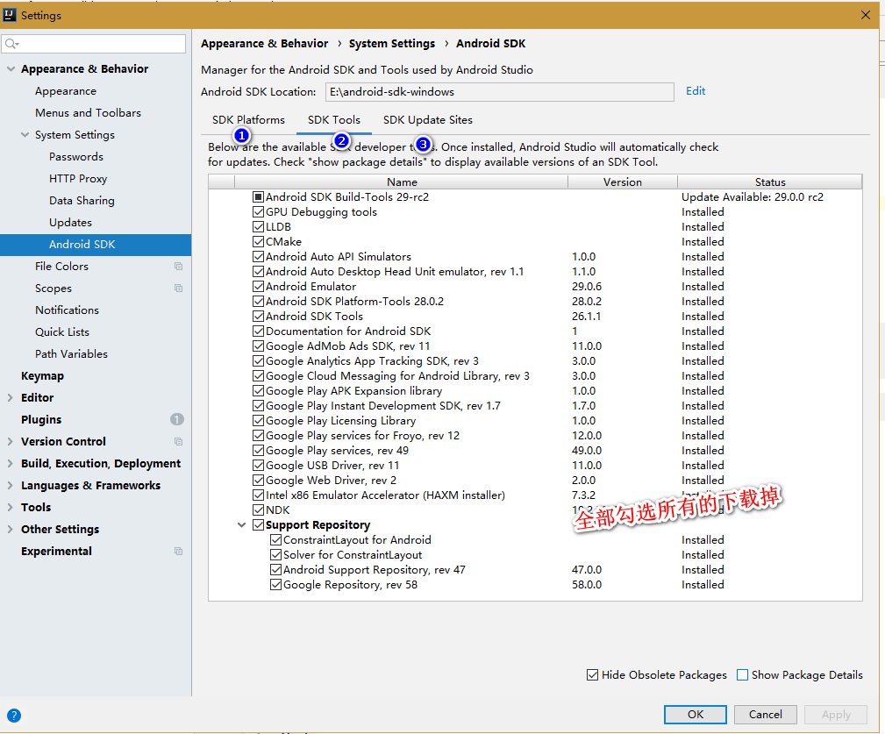

## 新技术

* 基于JavaScript的web端流程图：[flowchart](https://gojs.net/latest/samples/flowchart.html)

* 无意搜到一个博客: [https://www.finen.top](https://www.finen.top),采用了vuepress为平台，代码托管在： [https://github.com/hirCodd/vuepress-blog](https://github.com/hirCodd/vuepress-blog)

* 整理了一个`ionic-vue`的项目，可以访问demo地址: [ionic-vue](https://seniortesting.club/ionic-vue)

## vuepress主题修改

* 基本上面的评论由`"@vssue/vuepress-plugin-vssue`转为`valine`,有时间再弄。。。 ,参考一个优秀的博客主题定制： [vuepress 博客主题定制](https://www.unaxu.com/blog/posts/005-one-how-to-generate-static-blog-with-vuepress.html)


## Capacitor 初探

折腾到使用安卓，然后重新安装对应的android sdk 和模拟器镜像:(强迫症作祟。。。)
1. 下载sdk-windows.exe文件，然后运行SDK Manager下载： SDK Platform tool, SDK build tool,Android SDK Platform 28 ,Google Play Intel x86 Atom_64 System Image ，重新制作了一个
Android的镜像文件。打开idea配置相关的所有工具和update site信息：



 ::: warining 镜像文件
 推荐安装不带Google Play的镜像，否则可能不能安装未知来源的apk文件,坑啊，千万不要使用
 :::
2. 如下为对应的`capacitor.config.json`配置信息: 
``` json
{
  "appId": "com.github.app",
  "appName": "com.github.vue-mobile",
  "bundledWebRuntime": true,
  "webDir": "dist",
  "npmClient": "yarn",
  "windowsAndroidStudioPath": "E:\\Program Files\\JetBrains\\IntelliJ IDEA 2019.1\\bin\\idea64.exe",
  "android": {
    "allowMixedContent": true,
    "captureInput": true,
    "webContentsDebuggingEnabled": true
  },
  "ios": {
    "cordovaSwiftVersion": "3.2",
    "minVersion": "10.3"
  }
}


```

3. capacitor中使用的Android SDK是Android SDK 27，不是最新的Android SDK 28, 所以这里使用Android 27的镜像，对应的是Android 8.1

::: warning IDEA的SDK Manager和直接使用的Android SDK Manager
  使用了Android sdk manager后以前的Android sdk manager将不能直接通过双击 `sdk manager.exe` 打开,原因是idea 进行了相关的替换操作，
  参考： [android SDK SDK Manager.exe 无法打开，一闪而过最终解决办法](https://blog.csdn.net/wang295689649/article/details/60960953)
  所以后面的新建镜像，还有下载SDK什么的都最好直接在IDEA 里面进行操作，不再使用Android SDK Manager
:::

4. 通过`this.$router.push()`访问子路由没有问题，但是通过刷新页面访问嵌套的子路由，总是报如下的错误: 

```
Uncaught SyntaxError: Unexpected token <

```

参考错误: [Uncaught SyntaxError: Unexpected token <](https://stackoverflow.com/questions/49276879/second-level-vue-route-throws-error-when-accessed-directly)

原因分析： 仔细查看对应的html的文件，会发现所有的生成的js文件的路径为如下：`js/app.js`,实际上应该是: `/js/app.js`, 所以应该是对应的`vue.config.js`里面的`publicPath`设置出问题：
`publicPath: process.env.NODE_ENV === 'development' ? './' : '/',`, 注意我在这里设置的路径开发下是./ ,这个设置是因为在Vue Cli2中为了配置静态路径这样做的，现在的Vue Cli3不需要这样配置了，所以修改成: `publicPath: process.env.NODE_ENV === 'development' ? '/' : '/'`. 