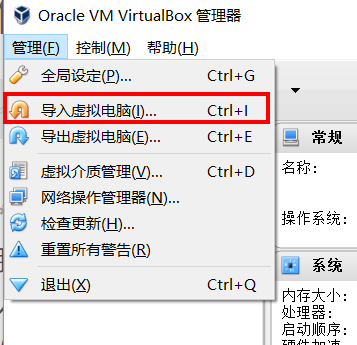
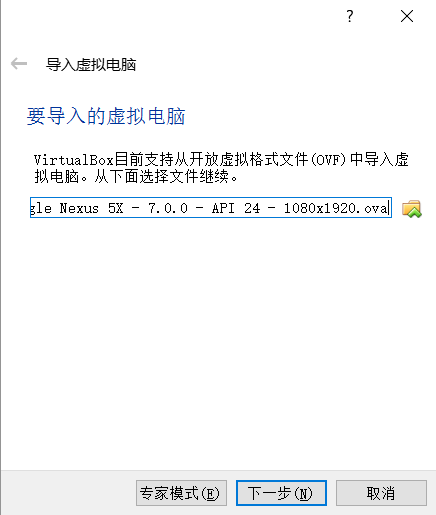
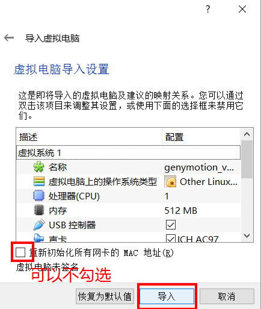
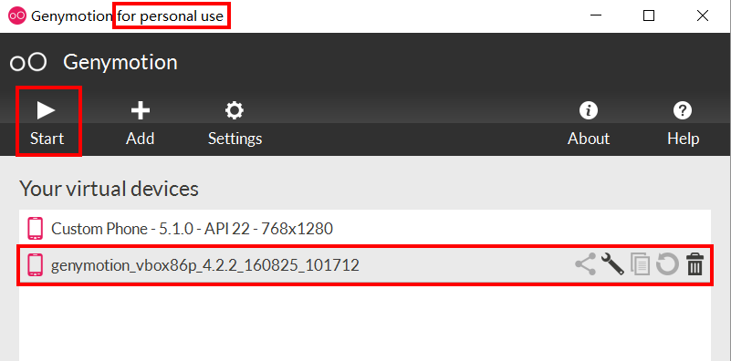

## 工作

### Ionic 闲置材料商城

参考：[github ionic源码商城](https://github.com/search?o=desc&q=ionic%E5%95%86%E5%9F%8E&s=updated&type=Repositories)

## 问题

### How to make a transparent(tbm ) header / toolbar?

针对Ionic2可以参考如下链接: [Create a Stylish News Feed Layout in Ionic 2 & 3](https://www.joshmorony.com/create-a-stylish-news-feed-layout-in-ionic-2/)

``` html
<ion-header translucent>
</ion-header>

 <ion-content
      no-padding
      fullscreen
      :scrollEvents="true" @ionScroll="scrollContent">
    
</ion-content>

```

### `mapGetters`,`mapState` 都放在computed里面作为计算属性

```
computed: {
    ...mapState({
        islogged: state=>state.user.islogged
    }),
    ...mapGetters(['islogged'])
}
```

### genymotion的虚拟机不能现在在android studio的device列表中

https://stackoverflow.com/questions/36142055/genymotion-device-doesnt-appear-on-device-chooser-android-studio

* click the run button to compile project
* device empty list appear
* start genymotion
* device will appear in the list


### genymotion拖动apk文件出现错误： an error occurred while deploying the file.

> 原来是genymotion对应的adb于Android sdk中的adb版本不兼容的问题，换成genymotion内置的adb是没有问题的，所以升级genymotion到3.0，然后升级对应的android sdk到对应的版本即可。

### Genymotion 的android 9.0 可以使用 Android 8.1 的 ARM_Translation_Oreo_android8 ，测试可用。没有找到最新的Android 9.0 的arm translation


###  无法加载webgl

```
IconLoader: Could not find icon drawable from resource
    android.content.res.Resources$NotFoundException: Resource ID #0xffffffff
        at android.content.res.ResourcesImpl.getValueForDensity(ResourcesImpl.java:225)
        at android.content.res.Resources.getDrawableForDensity(Resources.java:887)
        at android.content.res.Resources.getDrawable(Resources.java:827)
        at com.android.systemui.shared.recents.model.IconLoader.createNewIconForTask(IconLoader.java:118)
        at com.android.systemui.shared.recents.model.IconLoader.getAndInvalidateIfModified(IconLoader.java:94)
        at com.android.systemui.shared.recents.model.RecentsTaskLoader.getAndUpdateActivityIcon(RecentsTaskLoader.java:325)
        at com.android.systemui.shared.recents.model.RecentsTaskLoadPlan.executePlan(RecentsTaskLoadPlan.java:202)
        at com.android.systemui.shared.recents.model.RecentsTaskLoader.loadTasks(RecentsTaskLoader.java:173)
        at net.oneplus.quickstep.RecentsModel.onTaskStackChangedBackground(RecentsModel.java:275)
        at com.android.systemui.shared.system.TaskStackChangeListeners.onTaskStackChanged(TaskStackChangeListeners.java:80)
        at android.app.ITaskStackListener$Stub.onTransact(ITaskStackListener.java:50)
        at android.os.Binder.execTransact(Binder.java:752)
        
        
        
         java.util.ConcurrentModificationException
        at java.util.ArrayList$Itr.next(ArrayList.java:860)
        at android.app.ActivityThread.installContentProviders(ActivityThread.java:6106)
        at android.app.ActivityThread.handleBindApplication(ActivityThread.java:6021)
        at android.app.ActivityThread.access$1300(ActivityThread.java:207)
        at android.app.ActivityThread$H.handleMessage(ActivityThread.java:1748)
        at android.os.Handler.dispatchMessage(Handler.java:106)
        at android.os.Looper.loop(Looper.java:193)
        at android.app.ActivityThread.main(ActivityThread.java:6863)
        at java.lang.reflect.Method.invoke(Native Method)
        at com.android.internal.os.RuntimeInit$MethodAndArgsCaller.run(RuntimeInit.java:537)
```
乐固加固后出现问题： https://cloud.tencent.com/developer/ask/197885/answer/308416


### cordova run android

```
le: not installed
Could not find an installed version of Gradle either in Android Studio,
or on your system to install the gradle wrapper. Please include gradle 
in your path, or install Android Studio


```

```
 https://res.yitieyilu.com/upload/pano/1ba16376e6284cc8af8f41413514242a/index.xml", source: file:///android_asset/www/static/js/61.bundle.js (1)
2019-05-06 12:29:49.153 4087-4146/com.yitieyilu.app E/chromium: [ERROR:context_group.cc(137)] ContextResult::kFatalFailure: WebGL1 blacklisted
2019-05-06 12:29:49.160 4087-4146/com.yitieyilu.app E/chromium: [ERROR:context_group.cc(137)] ContextResult::kFatalFailure: WebGL1 blacklisted
```


## 资源下载

1. All of Genymotion OVAs

[最全Genymotion镜像下载](https://gist.github.com/runo280/e4be3e04c24b463b55ddf012c5cfbdc4),

### 安装genymotion虚拟机

1. 启动genymotion，点击add，等待下载完成，回到目录： 
C:\Users\Administrator\AppData\Local\Genymobile\Genymotion\ova，里面是刚刚下载的虚拟机文件。

2. 启动genymotion虚拟机即可.

3. genymotion启动后，对应的`adb.exe`进程也会起来


###  ~~使用步骤（不适用直接下载ova的方式)~~

1. 下载上面的地址的ova文件
2. 仅打开oracle vm virtualBox，暂时不要打开Genymotion客户端。管理—-导入虚拟电脑 ，如下：

3. 选择导入下载的.ova镜像—-下一步—–导入。等待其导入成功后关闭即可，不要尝试在virtualBox中打开。打开Genymotion客户端，选中点击Start，就可以使用了。 


