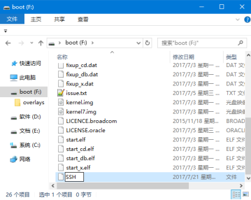

## 前言

> 因为树莓派的SD卡不能读文件，需要重新安装对应的树莓派，开始了今天的折腾记。。。

## 树莓派的安装

1. 下载对应的镜像，看到官方新推了一种镜像，只有基本的桌面的镜像，不像以前的安装很多推荐的软件占了不少空间。。。。

- [镜像地址Raspbian Stretch with desktop](https://www.raspberrypi.org/downloads/raspbian/)
- [格式化SD Card Format](https://www.sdcard.org/downloads/formatter_4/eula_windows/index.html)
- [镜像写入工具 Etcher ](https://etcher.io/)

::: tip 官方安装指南
 安装地址参考： https://www.raspberrypi.org/documentation/installation/installing-images/windows.md
:::


2. (**注意这一步骤**)开启SSH, 新建 一个`ssh`空文件（无后缀）放在从树莓派拿下的SD卡，连接到电脑上并打开后的Boot目录:

  

3. 新建一个连接wifi的文件，文件名为: `wpa_supplicant.conf`同样放在从树莓派拿下的SD卡，连接到电脑上并打开显示的Boot目录下, ,With this file in place, Raspbian will move it in `/etc/wpa_supplicant/` when the system is booted. `wpa_supplicant.conf`文件内容格式如下:
```conf
ctrl_interface=/var/run/wpa_supplicant GROUP=netdev
update_config=1

network={
    ssid="FOffice"
    psk="L0ngh)*%z2&r7p1"
}
```

或者`sudo nano /etc/wpa_supplicant/wpa_supplicant.conf` 登录后修改查看

4. 初次使用树莓派系统时，默认用户是`pi` ，密码为`raspberry`

```sh
sudo systemctl enable ssh
sudo systemctl start ssh
sudo service ssh status
$ ssh root@127.0.0.1

```
5. 查看系统架构 which debian architecture  used

```
> dpkg --print-architecture
```
6. 更新软件源 ：`sudo nano /etc/apt/source.list` 源更新

> http://www.shumeipaiba.com/wanpai/jiaocheng/16.html

```
$ sudo nano /etc/apt/sources.list #编辑sources.list 文件，写上下面的镜像路径

deb http://mirrors.aliyun.com/raspbian/raspbian/ wheezy main non-free contrib
deb-src http://mirrors.aliyun.com/raspbian/raspbian/ wheezy main non-free contrib

deb http://mirrors.tuna.tsinghua.edu.cn/raspbian/raspbian/ stretch main contrib non-free rpi
deb-src http://mirrors.tuna.tsinghua.edu.cn/raspbian/raspbian/ stretch main contrib non-free rpi


```

7. 配置树莓派

```
$ sudo raspi-config
```
Once prompted, you should select the first option, “1. Expand File System”, hit Enter on your keyboard, arrow down to the “” button, and then reboot your Pi:
After rebooting, your file system should have been expanded to include all available space on your micro-SD card. You can verify that the disk has been expanded by executing df -h and examining the output:

- 改变hostname名称(可选，上面的raspi-config也可以配置)
Edit the Hostname File. Next type: sudo nano /etc/hostname (and then hit enter) ...
Commit the changes. ...
Change the /boot/hostnames file. ...
Reboot the Pi.

 > 这里注意还需要修改 /etc/hosts里面的配置否则会报无法解析host的错误:

```
 $ sudo nano /etc/hosts 
 127.0.1.1       PI 
```

- 改变密码 pi/root（可选，上面的raspi-config也可以配置)

```
sudo passwd pi
sudo passwd root
sudo passwd --unlock root  
```

8. terminal下不同用户切换

```
# 切换到root用户
 `sudo su -`
# 从root切换到特定的用户
`sudo su - pi`

whoami

```

9. 树莓派mysql安装和配置

```

sudo apt-get install mysql-server

During the installation, you’ll be asked to set a root password (leaving the spot blank means you’ll have no password).


sudo mysql_secure_installation


In this stage, you’ll have the option to change your root password. Since you only just set it, you might as well say no. Say yes to everything else.

```
安装完成后，远程是禁止访问的需要注释下面的一行代码：

```
注释掉skip-networking选项来开启远程访问.
注释bind-address项，该项表示运行哪些IP地址的机器连接，允许所有远程的机器连接
但是配置文件这么多，这两选项究竟在哪呢？这个时候使用grep在/etc/mysql/目录中的所有文件中递归查找，看哪个文件中含有这个字符串
我们输入：
grep -rn "skip-networking" *
```

## 迁移公众号

> 在关注者与公众号产生消息交互后，公众号可获得关注者的OpenID（加密后的微信号，每个用户对每个公众号的OpenID是唯一的。对于不同公众号，同一用户的openid不同）。公众号可通过本接口来根据OpenID获取用户基本信息，包括昵称、头像、性别、所在城市、语言和关注时间。
也就是openid不唯一，比如A用户在x公众号的openid为o80v00ZiTb7H2Y2z9xLJQUpDeXLc，A用户在Y公众号的openid为o6_bmjrPTlm6_2sgVt7hMZOPfL2M。


## 在ion-content中加入背景图片

```
ion-content {
    --background: url('/assets/img/background/background.png') no-repeat 100% 100%;
}

ion-content{
    --background: #fff url('../../assets/images/cover.jpg') no-repeat center center / cover;
}


ion-content {
    --background: none;
    background-image: url('/assets/imgs/page_bg.jpg');
    background-position: center top;
    background-repeat: no-repeat;
    background-size: cover;
}

```

##  PS 去水印方法

> 暂无

## ionic居中元素

```
 margin: 0 auto;
```

## `type=number`没有弹出数字键盘

```html 
  type="tel" pattern="[0-9]*"

```

## ionic的键盘会将内容弹到顶部，布局混乱

it's bug in ionic, once you focus on any input the keyboard will show up and will add padding-bottom for the scroll-content class to lift the for above the keyboard and it doesn't remove the padding-bottom after you close the keyboard. I tried to check if I have any JS event on the mobile keyboard but we don't so my work around is to set a fixed padding-bottom for the scroll-content class to prevent changing it on the runtime.
参考： https://stackoverflow.com/questions/47239562/the-keyboard-pushes-a-div-up-out-of-the-screen
```
.scroll-content {
    padding-bottom: 0 !important;
 }
 ```