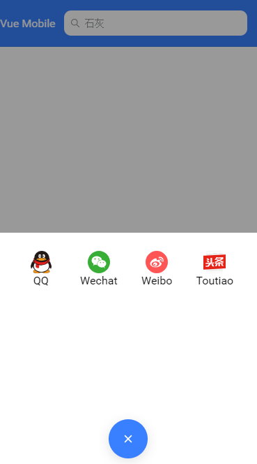

## ionic 优秀资源

> [copepen上的ionic优秀demo](https://my.oschina.net/u/1416844/blog/514361)

## 如何将ionic的actionsheet改成水平的horizontal button？

1. 参考Android的一个样式： [水平的bottom sheet](https://material.angularjs.org/latest/demo/bottomSheet)


## ionic 图钉affix实现固定任意位置的内容？

暂无

## ionic bottomsheet弹出带有表格的actionsheet?

全局样式中如下定义：

```
/*// 一半的弹出框*/
.half-modal {
  .modal-wrapper {
    height: 50%;
    top: 50%;
    position: absolute;
    display: block;
  }
}

```
效果如下：



## vant中的toast默认情况下，同一时间只允许一个实例存在，如何同时显示多个实例不影响？

```
 mounted () {
    // 注意此处的巨坑，
    this.$toast.allowMultiple()
  }
```

## 上传的图片右上角加上一个删除的按钮

```
<div style="position: relative">
    
    
</div>

```


## Mysql 树查询，递归查询，查询子节点

 1. 树查询的一个讲解： [mariadb](https://mariadb.com/kb/en/library/recursive-common-table-expressions-overview/)
 2. mysql解决方案: [statckoverflow](https://stackoverflow.com/questions/20215744/how-to-create-a-mysql-hierarchical-recursive-query)


[一个详细的讲解递归的例子文章:](https://www.cnblogs.com/elevenlang/p/3490844.html)

```

  with recursive cte (PanoUserKey, PanoManagerUserKey) as (
  select     
             pum.PanoUserKey,
            pum.PanoManagerUserKey
  from       PanoUserManager pum
  where      pum.PanoManagerUserKey = 258
  union all
  select     
             pum.PanoUserKey,
            pum.PanoManagerUserKey
  from        PanoUserManager pum
  inner join cte
          on pum.PanoManagerUserKey = cte.PanoUserKey
)
select * from cte;

```

**讲解**步骤： 

1. CTE支持递归查询，定义一个递归CTE至少需要两个(可能更多)查询：第一个查询称为定位点成员，第二个查询称为递归成员

1.1 至少定义两个查询，第一个查询是定位查询，定位查询只被调用一次， 第二个查询为递归成员

- 此处的定位查询只返回谁的上级是 258的员工，只执行一次，获取当前结果
- 第二个递归查询，在第一次定位查询后， cte返回的结果集是上级258的员工的结果集。
- 然后与总的结果表进行内联，内联的条件是这次的查询的节点id对应的总结果的父节点id（**注意因为我们需要得到的是父节点下面的所有子节点**，所以是当前结果的节点id对应总结果的父节点id,这个同定位查询的子查询后面的字段一致），返回上一次调用的结果中返回的直接下属。
- 接下来的就是多次调用递归查询与总表一直在递归查询，直到无法再查询到结果集为止。


### 其他参考SQL语句

- 定位查询可以是任意查询SQL 

```sql
WITH CTE_TEMP   --公用表表达式（Common Table Expression)
as(
select * FROM ProvinceCity_Test where value LIKE '%西安%'
union ALL
SELECT a.* FROM ProvinceCity_Test a
INNER JOIN CTE_TEMP b ON a.ID = b.ParentID    --父子级关系,递归,递归部分不允许使用外部联接(不允许使用left join等)
)  
SELECT * FROM CTE_TEMP   -- CTE后面必须直接跟使用CTE的SQL语句（如select、insert、update等），否则，CTE将失效。

```

- 递归查询中查询结果分隔符 

[参考递归查询结果分隔符](https://blog.csdn.net/dufemt/article/details/80773394)


```sql  
with RECURSIVE cte as
(
select a.id,cast(a.name as varchar(100)) from tb a where id='002'
union all 
select k.id,cast(c.name||'>'||k.name as varchar(100)) as name  from tb k inner join cte c on c.id = k.pid
)select id,name from cte ;
```


## 建表规范参考阿里巴巴手册

1. UNSIGNED属性就是将数字类型无符号化，与C、C++这些程序语言中的unsigned含义相同。例如，INT的类型范围是-2 147 483 648 ～ 2 147 483 647， INT UNSIGNED的范围类型就是0 ～ 4 294 967 295


## raspberry上没有mariadb 10.3支持

> MariaDB's 10.3 builds are only for i386 (32-bit), amd64 (64-bit) and ppc64el (PowerPC). Your Pi has an ARM processor which needs a particular build for that architecture.
官方没有发布对应的这种包。

