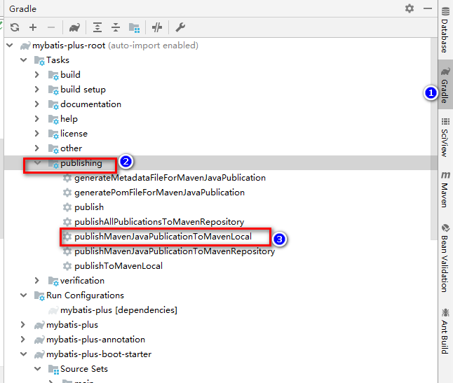

## mybatis 真香记录

### 踩坑记录

* 问题描述：
>  单元执行正常，正常service层调用报错，代码很简单：
 1. `sysUserMapper.selectOne(Wrappers.<SysUser>lambdaQuery().eq(SysUser::getUsername,username));`
 2. 报错信息如下：

```
2019-05-15 20:31:58.892 [http-nio-8085-exec-3] DEBUG org.springframework.web.servlet.mvc.method.annotation.ExceptionHandlerExceptionResolver.doResolveHandlerMethodException:403 - Using @ExceptionHandler public com.yanzhi.common.response.WebResponse com.yanzhi.core.vrpanoapp.exception.GlobalExceptionHandler.handleExceptionHandler(java.lang.Exception)
2019-05-15 20:31:58.893 [http-nio-8085-exec-3] ERROR com.yanzhi.core.vrpanoapp.exception.GlobalExceptionHandler.handleExceptionHandler:223 - 未捕获的系统异常：nested exception is org.apache.ibatis.builder.BuilderException: Error evaluating expression 'ew.sqlSegment != null and ew.sqlSegment != '' and ew.nonEmptyOfWhere'. Cause: org.apache.ibatis.ognl.OgnlException: sqlSegment [com.baomidou.mybatisplus.core.exceptions.MybatisPlusException: Your property named "username" cannot find the corresponding database column name!]
org.mybatis.spring.MyBatisSystemException: nested exception is org.apache.ibatis.builder.BuilderException: Error evaluating expression 'ew.sqlSegment != null and ew.sqlSegment != '' and ew.nonEmptyOfWhere'. Cause: org.apache.ibatis.ognl.OgnlException: sqlSegment [com.baomidou.mybatisplus.core.exceptions.MybatisPlusException: Your property named "username" cannot find the corresponding database column name!]
```
* 解决方法：

> 移除 `dev-tools`,参见 [https://github.com/baomidou/mybatis-plus/issues/1137](https://github.com/baomidou/mybatis-plus/issues/1137)


### gradle project publish to local maven repository 



or

```
./gradlew build publishToMavenLocal
```