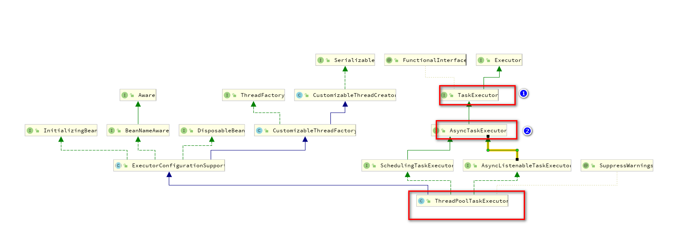

## springboot 异步/多线程处理 async

### 多线程的几个概念
- coreSize 核心线程 ，这里设置为 **8** 
- queueCapacity 当核心线程都在跑任务，还有多余的任务会存到此处，这里设置为 **20** 
- maxSize 如果queueCapacity存满了，还有任务就会启动更多的线程，直到线程数达到maxPoolSize。如果还有任务，则根据拒绝策略进行处理。
，这里设置为 **15** ，超过将会按照**拒绝策略**进行处理
- keepAlive 线程存活时间

> 所以以上的设置，保证了最大只有15个线程在跑任务
1. 当线程数量<8的时候，如果有新的线程需要执行，则以前的线程不会销毁重复利用，直到启动的线程达到8个的时候，才会重复利用核心线程
2. 也就是说如果启动的线程是<=28个，总运行这28的线程的一直是线程池中的8个核心线程交替执行这些线程。
1. 当启动的线程>28个，此时启动新的线程,直到总线程数量达到maxSize
2. 当启动的运行总线程> 15个的时候，此处会安装下面的拒绝策略进行处理线程

拒绝策略如下：

1. 由任务调用线程执行   `new ThreadPoolExecutor.CallerRunsPolicy();`
2. 抛异常    `new ThreadPoolExecutor.AbortPolicy();`
3. 多余的直接抛弃   `new ThreadPoolExecutor.DiscardPolicy();`
4. 根据FIFO（先进先出）抛弃队列里任务  `new ThreadPoolExecutor.DiscardOldestPolicy();`

而跟进代码发现：`TaskExecutionAutoConfiguration`类实现了`ThreadPoolTaskExecutor` bean,我一直都是用的是`TaskExecutor`，直到最近我发现这个bean异步操作后不能返回异步的结果。
所以这里推荐的还是使用`ThreadPoolTaskExecutor` 和`AsyncTaskExecutor`,二者都可以返回多线程执行的结果。如下所示：




::: warning 空闲的coreSize线程
空闲的线程不占用内存，参考文档：[stackoverflow](https://stackoverflow.com/questions/43795545/is-idle-thread-taking-cpu-execute-time-in-java-executors)
:::


### ThreadPoolTaskExecutor 等待所有的线程执行完成 `future.get()`

```java

@Service
@Slf4j
public class AsyncService {

    @Autowired
    private ThreadPoolTaskExecutor taskExecutor;

    public void longTask() throws ExecutionException, InterruptedException {
        List<ListenableFuture<Integer>> alllist = Lists.newArrayList();
        IntStream.range(0, 200).forEach(intValue->{
            ListenableFuture<Integer> thread = taskExecutor.submitListenable(() -> {
                String name = Thread.currentThread().getName();
                log.info("线程： {}", name);
                Thread.sleep(5 * 1000);
                log.info("结束: {}", name);
                return intValue;
            });
            alllist.add(thread);
        });
        log.info("Waiting for everything to finish...");
        for (ListenableFuture<Integer> future : alllist) {
            // 此处的get方法会等待该线程执行完成
            Integer threadIndex = future.get();
            log.info("thread: {}, is done: {}", threadIndex, future.isDone());
        }

    }
}

```

## 遍历修改List中的对象属性

```java
List<JobListEntity> newRecord = records.stream().map(record -> {
            String jobName = record.getJobName();
            try {
                JobDetail jobDetail = scheduler.getJobDetail(new JobKey(jobName, jobName));
                JobDataMap jobDataMap = jobDetail.getJobDataMap();
                record.setJobData(jobDataMap);
            } catch (SchedulerException e) {
                e.printStackTrace();
            }
            return record;
        }).collect(Collectors.toList());
```

或者如下代码:

```java
  records.forEach(record->{
            String jobName = record.getJobName();
            try {
                JobDetail jobDetail = scheduler.getJobDetail(new JobKey(jobName, jobName));
                JobDataMap jobDataMap = jobDetail.getJobDataMap();
                record.setJobData(jobDataMap);
            } catch (SchedulerException e) {
                e.printStackTrace();
            }
        });
```

## mybatis `Blob`字段类型转换

::: warning MYSQL的BLOB /CBLOB 字段
> 经确认mybatis对应的Blob数据库类型不是`java.sql.Blob`类型，否则获取的结果是null，应该对应的是`byte[]`,而`clob`对应的则是 `String`
::: warning